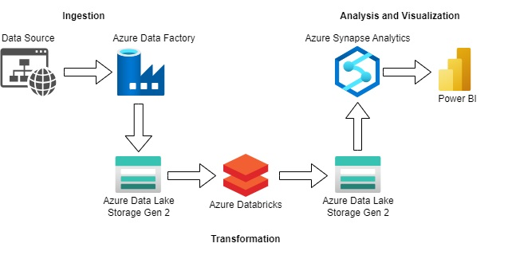
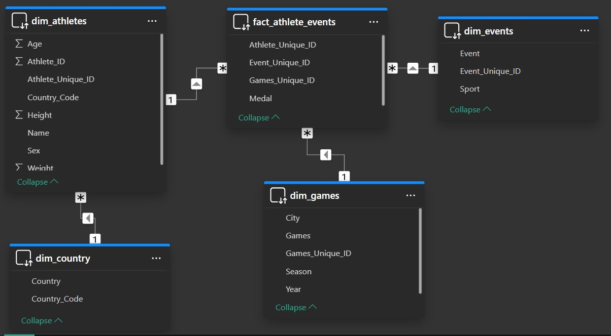

# Olympics Data Engineering Project on Azure

## Introduction

This end-to end-data engineering project uses Azure services to extract, clean and analyze data to provide insights into athlete performance, country rankings and event trends. It integrates Azure Data Factory for orchestrating data pipelines, Azure Data Lake Storage Gen 2 as the central data storage, and Azure Databricks for scalable data transformation. Data is then stored and modeled in a lake database within Azure Synapse Analytics for optimized querying. Finally Power BI delivers interactive visualizations of the transformed data.

## Architecture

## Technology Used
1. Programming Language - PySpark
2. Scripting Language - SQL
3. Azure Cloud Platform
   * Azure Data Factory
   * Azure Data Lake Storage Gen 2
   * Azure Databricks
   * Azure Synapse Analytics
   * Power BI
   * Azure Key Vault

## Dataset Used
120 years of Olympic history: athletes and results
This is a historical dataset on the modern Olympic Games, including all the Games from Athens 1896 to Rio 2016.
Note that the Winter and Summer Games were held in the same year up until 1992. After that, they staggered them such that Winter Games occur on a four year cycle starting with 1994, then Summer in 1996, then Winter in 1998, and so on. A common mistake people make when analyzing this data is to assume that the Summer and Winter Games have always been staggered.

Links to the dataset: 
https://github.com/Nizra/olympics/blob/47bbd491ed276063ed9ff15a8019ff93c3684e6e/noc_regions.csv
https://github.com/Nizra/olympics/blob/47bbd491ed276063ed9ff15a8019ff93c3684e6e/athlete_events.csv.zip

Original data source: https://www.kaggle.com/datasets/heesoo37/120-years-of-olympic-history-athletes-and-results

## Data Model

## Scripts for Project
1. [Extract raw data using Azure Data Factory json file](copydata_pipeline_support_live.zip)
1. [Bronze to silver transformation file](Olympics_bronze_to_silver.dbc)
2. [Silver to gold transformation file and load file](Olympics_silver_to_gold.dbc)

